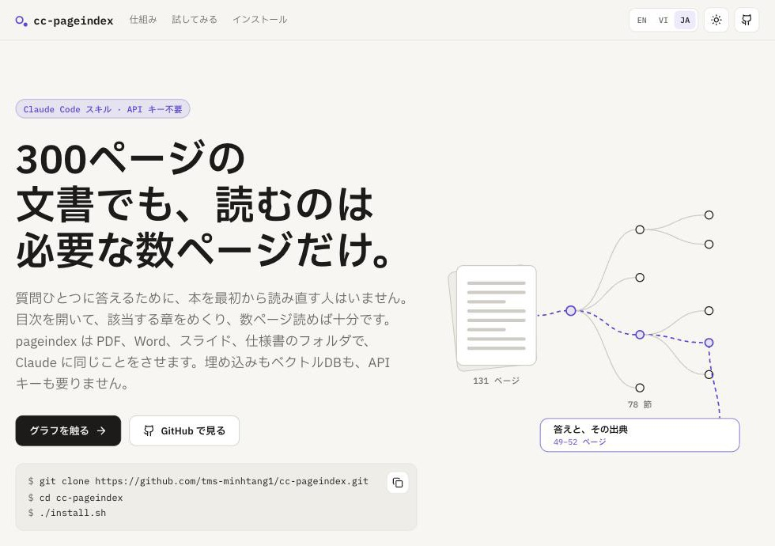
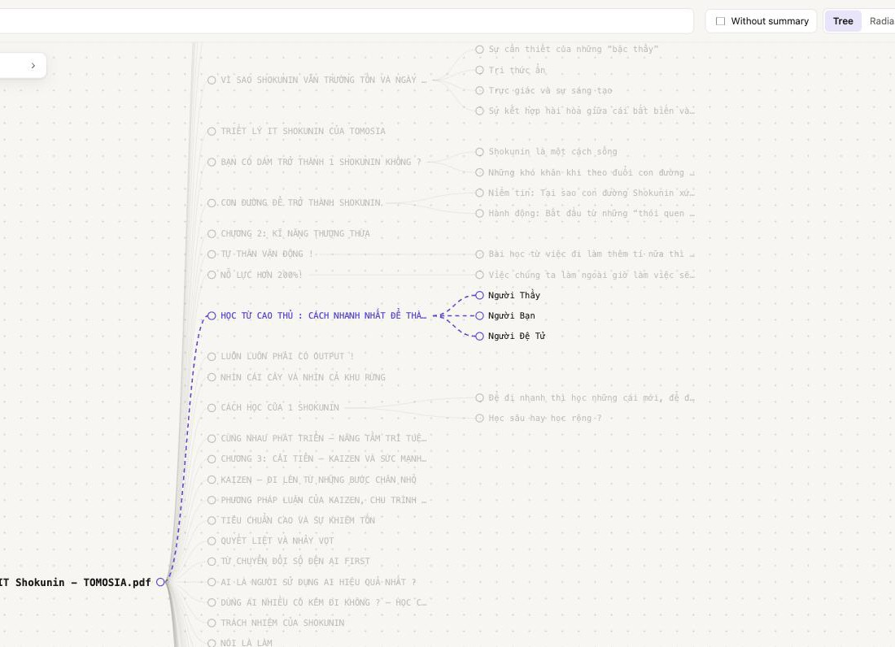

<p align="center">
  
</p>

<h1 align="center">cc-pageindex</h1>

<p align="center"><a href="README.md">English</a> · <a href="README.vi.md">Tiếng Việt</a> · <b>日本語</b></p>

<p align="center">
  <b>300ページの文書でも、読むのは必要な数ページだけ。</b><br>
  Claude Code スキル · API キー不要
</p>

<p align="center">
  <a href="https://pagindex.vercel.app/ja"><b>紹介サイト</b></a> ·
  <a href="https://pagindex.vercel.app/demo/shokunin.html">グラフを触る</a> ·
  <a href="#インストールは-1-分ほど">インストール</a>
</p>

<p align="center">
  
  
  
  
  
</p>

<p align="center">
  <a href="https://pagindex.vercel.app/ja"></a>
</p>

質問ひとつに答えるために、本を最初から読み直す人はいません。目次を開いて、該当する章をめくり、数ページ読めば十分です。どこに書いてあったかも覚えています。

Claude にはその習慣がありません。300ページの仕様書を貼り付ければトークンを消費し、コンテキストはあふれ、長いほど読み飛ばします。貼らなければ、それでも答えます。流暢に、そして間違って。**cc-pageindex** は Claude に人と同じ読み方を教えます。目次を見て、正しい節を開き、読んでから答える。確かめられるよう、ページを添えて。

レポート、契約書、日本語の画面仕様書、社内の手引き——最初から読み直したくないほど長いものなら何でも使えます。

```
あなた: 会員管理の仕様書で、退会処理は email カラムをどう更新する?

Claude: email を "<元のアドレス>_<現在時刻>" に書き換え、あわせて
        status = 退会、encrypted_password = ランダムな 20 文字をハッシュ化した値、
        phone_number = NULL、quit_at = 現在時刻 にします。
        出典: 2.1.会員詳細画面_機能詳細.adoc、110 行目。
```

## 長い文書には、いつもの聞き方が通用しない

| | やり方 | 何がまずいか |
| --- | --- | --- |
| ✗ | **全部チャットに貼る** | トークンを消費し、コンテキストがあふれ、長いほどモデルは読み飛ばします。 |
| ✗ | **細かく切ってベクトル検索** | 断片は属していた章を失い、表は二つに割れます。質問と「似ている」段落が、答えの書いてある段落とは限りません。しかも埋め込みモデルとベクトルDBを運用し、文書が変わるたびにインデックスし直すことになります。 |
| ✓ | **目次をたどる** | きちんとした文書には最初から構造があります。それを保てば、答え探しは節を選ぶことになり、どこを読んだか分かっているので出典も自然に付きます。 |

違いはモデルの賢さではなく、正しいページを読んでいるかどうかです。

## 面倒な作業はツールが、考えるのは Claude が

ツールは機械的な処理だけを行い、モデルを一切呼びません。答えの文章はすべてあなたの Claude Code セッションが書きます。だから API キーは要りません。

1. **一度だけインデックス** · *ツール*
   PDF のレイアウト、Word の見出しスタイル、AsciiDoc の階層、スライドのタイトルから目次を作り、手元に保存します。スキャンや素のテキストは、Claude が一度だけ読んで見出しを付けます。
2. **ローカルで節を探す** · *ツール*
   質問を各節のタイトルと要約と照らし合わせ、珍しい語ほど重く数えます。日本語と中国語は二文字ずつに分けます。同じ質問なら、毎回同じ順位になります。
3. **読んでから答える** · *Claude*
   上位の数節だけを開き、本当に答えになっているか確かめ、ページ・スライド・ファイルと行番号を添えて答えます。

仕組みの詳細は [How it works](docs/how-it-works.md)(ベトナム語)にあります。

## 質問ひとつ、読んだのは4ページ

『SHOKUNIN IT – Cách người TOMOSIA làm việc』(131 ページ、78 節)での実際の実行です。ツールはモデルを使わずに全節を採点します。

```
#0036  CHƯƠNG 3: CẢI TIẾN – KAIZEN VÀ SỨC MẠNH CỦA AI      13.91   49–50 ページ   ← 読んだ
#0037  KAIZEN – ĐI LÊN TỪ NHỮNG BƯỚC CHÂN NHỎ               8.78   51–52 ページ   ← 読んだ
#0042  AI LÀ NGƯỜI SỬ DỤNG AI HIỆU QUẢ NHẤT ?                7.93   61–62 ページ
```

Claude は上位の2節——131 ページ中の4ページ——を開いて答えます。

> **職人は改善(カイゼン)と AI をどう組み合わせるのか?**
>
> どちらか一方を選ぶのではありません。職人は小さく継続的に良くするカイゼン——1% の原則、(1.01)^365——を守り、AI をその努力を増幅する道具として使います。改善が続くのは、それが共通の基準になったときだけ。坂の上へ大砲を引き上げるとき、ずり落ちないよう差し込む楔のように。
>
> <sub>出典: 49–52 ページ</sub>

本はベトナム語、質問と答えは日本語です。Claude は質問された言語で答えます。

## グラフはスキルに付いてきます

Claude に「プレビューして」と頼むか、自分で `pi.py html` を実行すると、オフラインで動く HTML ファイルが 1 つできます。中では目次がグラフになり、draw.io のように自由に動かせるボードに並びます。

<p align="center">
  <a href="https://pagindex.vercel.app/demo/shokunin.html"></a>
</p>
<p align="center"><sub><a href="https://pagindex.vercel.app/demo/shokunin.html">画像をクリックすると本物を触れます</a></sub></p>

- **どの経路もたどれる** — 節にカーソルを合わせると、ルートからの経路と配下の枝全体が光ります。
- **要らない枝は畳む** — 丸をクリックすると枝がまとまり、クリックした節は元の位置から動きません。
- **ツリーか放射状か** — タイトルを読むなら左から右へ、全体の形を見るなら放射状に。
- **検索と点検** — 一致した節が光って枝が開き、Enter で順に移動。要約のない節もワンクリックで一覧できます。
- **数字がひと目で** — 階層ごとの節数、畳んだ枝、各節が文書のどれだけを占めるか。
- **1 ファイル、オフライン** — サーバーも CDN も不要、何も外に出ません。ライトとダーク、マウス・キーボード・タッチに対応。

## 文書がもともと持つ構造を、そのまま使う

| 形式 | 目次の出どころ | インデックスのコスト |
| --- | --- | --- |
| テキスト付き PDF | レイアウトとしおり | モデル不要 |
| スキャン PDF | Claude が読むページ画像 | モデル 1 回 |
| Word `.docx` | 見出し 1–9 のスタイル | モデル不要 |
| PowerPoint `.pptx` | スライドごとに 1 節 | モデル不要 |
| Markdown | `#` 見出し | モデル不要 |
| プレーンテキスト | Claude が書く見出し | モデル 1 回 |
| AsciiDoc フォルダ | `=` の階層、ファイルと行で出典 | モデル不要 |

なぜこう分かれるのか:[Document formats](docs/formats.md)(ベトナム語)。

## インストールは 1 分ほど

必要なのは **[uv](https://github.com/astral-sh/uv)** か **Python 3.10 以上** だけです。uv があれば Python も不要で、必要なバージョンを uv が取ってきます。

```bash
git clone https://github.com/TOMOSIA-VIETNAM/cc-pageindex.git
cd cc-pageindex
./install.sh
```

Windows では `.\install.ps1` を実行します。削除は `./install.sh --uninstall`。

スクリプトが専用の Python 環境を作り、スキルを `~/.claude/skills/` にリンクします。あとはどのフォルダで開いた Claude Code セッションからでも使えます。

## あとは聞くだけ

**インデックス — 文書ごとに一度だけ:**

```
pageindex スキルで ~/Documents/report-2025.pdf をインデックスして
```

**質問 — その後はどのセッションからでも:**

```
pageindex スキルを使って。2025 年レポートの第3四半期の売上は?
```

**目次をグラフで見る:**

```
pageindex スキルで 2025 年レポートをプレビューして
```

答えには必ず出典が付きます。PDF ならページ、PowerPoint ならスライド、AsciiDoc ならファイルと行番号。たどれば確かめられます。

## もっと知る

以下のページはベトナム語です。

| | |
| --- | --- |
| [Document formats](docs/formats.md) | 無料でインデックスできる形式、トークンがかかる形式、その理由 |
| [How it works](docs/how-it-works.md) | ツールの役割、Claude の役割、質問に答えるまでの流れ |
| [The store](docs/store.md) | インデックスした文書の置き場所、中身、見方と削除の仕方 |
| [紹介サイト](webapp/README.md) | pagindex.vercel.app のソースとデプロイ方法(英語) |

## 制限

文書の中の画像は読みません。文書全体がスキャン PDF の場合は例外です。画面レイアウトや、画像の中にしか書かれていない内容についての質問には、不完全な答えになります。
