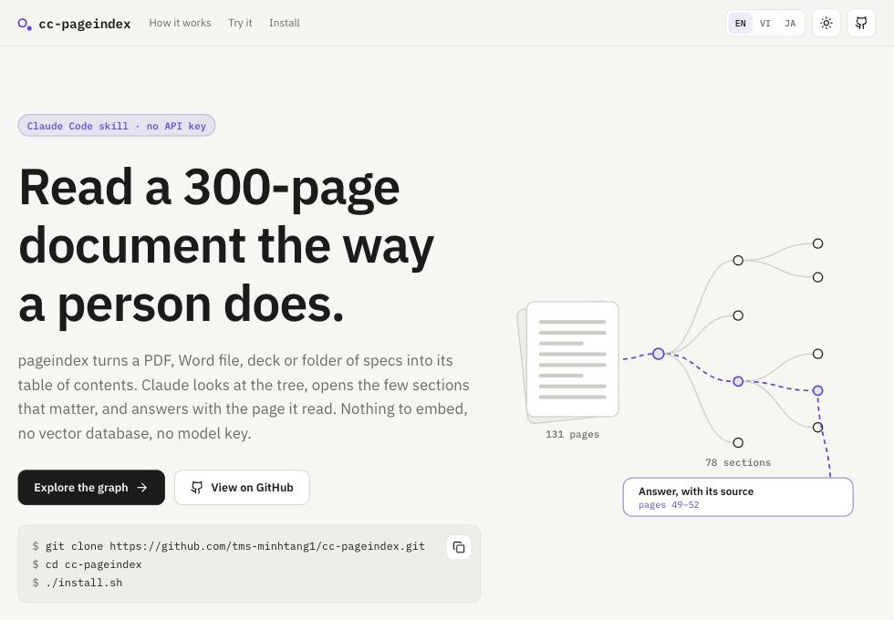

<p align="center">
  
</p>

<h1 align="center">cc-pageindex</h1>

<p align="center"><b>English</b> · <a href="README.vi.md">Tiếng Việt</a> · <a href="README.ja.md">日本語</a></p>

<p align="center">
  <b>Read a 300-page document the way a person does.</b><br>
  A Claude Code skill · no API key
</p>

<p align="center">
  <a href="https://pagindex.vercel.app/en"><b>Website</b></a> ·
  <a href="https://pagindex.vercel.app/demo/shokunin.html">Try the graph</a> ·
  <a href="#installed-in-about-a-minute">Install</a>
</p>

<p align="center">
  
  
  
  
  
</p>

<p align="center">
  <a href="https://pagindex.vercel.app/en"></a>
</p>

Nobody rereads a whole book to answer one question. You open the table of contents, flip to the right chapter, read a few pages — and you remember where you found it.

Claude doesn't have that habit. Paste in a 300-page spec and you burn tokens, overflow the context, and the longer it gets the more it skims. Leave the document out and it answers anyway: fluently, and wrong. **cc-pageindex** teaches Claude to read like a person: look at the contents, open the right section, read it, then answer — with the page, so you can check.

It works on reports, contracts, Japanese screen specs, internal handbooks — anything long enough that you'd rather not read it again from the top.

```
You:    In the 会員管理 spec, how does 退会処理 update the email column?

Claude: It rewrites email as "<old address>_<current timestamp>" and sets
        status = 退会, encrypted_password = a hashed random 20-character string,
        phone_number = NULL, quit_at = the current time.
        Source: 2.1.会員詳細画面_機能詳細.adoc, line 110.
```

## Every usual way of asking a long document falls short

| | Approach | What goes wrong |
| --- | --- | --- |
| ✗ | **Paste it all in** | Tokens burn, the context overflows, and the longer it gets the more the model skims. |
| ✗ | **Chop it into vectors** | Chunks lose the chapter they belonged to and tables split in half. A passage that *sounds like* the question is often not the one that answers it. And you now run an embedding model and a vector database, and re-index whenever the document changes. |
| ✓ | **Walk the table of contents** | Serious documents already carry their structure. Keep it, and finding the answer becomes choosing a section — and once you know where you read, citing it comes for free. |

The difference isn't a smarter model. It's reading the right page.

## The tool does the chores. Claude does the thinking.

The tool only does mechanical work and never calls a model. Every word of the answer comes from your own Claude Code session — which is why no API key is needed.

1. **Index once** · *tool*
   Builds a table of contents from a PDF's layout, Word heading styles, AsciiDoc levels or slide titles, and stores it on your machine. Scanned pages and plain text get headings Claude writes, once.
2. **Find the section locally** · *tool*
   The question is matched against every section's title and summary, rarer words counting more. Japanese and Chinese are split into two-character pieces. Ask the same question again and you get the same ranking.
3. **Read first, then answer** · *Claude*
   Opens only the top few sections, checks they really answer, and replies with the page, slide, or file and line.

The details are in [How it works](docs/how-it-works.md) (in Vietnamese).

## One question, 4 pages read

A real run against *SHOKUNIN IT – Cách người TOMOSIA làm việc* (131 pages, 78 sections). The tool scores every section, no model involved:

```
#0036  CHƯƠNG 3: CẢI TIẾN – KAIZEN VÀ SỨC MẠNH CỦA AI      13.91   p. 49–50   ← read
#0037  KAIZEN – ĐI LÊN TỪ NHỮNG BƯỚC CHÂN NHỎ               8.78   p. 51–52   ← read
#0042  AI LÀ NGƯỜI SỬ DỤNG AI HIỆU QUẢ NHẤT ?                7.93   p. 61–62
```

Claude opens the top two — 4 pages out of 131 — and answers:

> **How does a shokunin combine Kaizen with AI?**
>
> They don't pick one. A shokunin keeps Kaizen — improving in small, continuous steps, the 1% principle of (1.01)^365 — and treats AI as a tool that amplifies that effort. Improvement only lasts once it becomes a shared standard, like the wedge that stops a cannon sliding back while the team hauls it uphill.
>
> <sub>Source: pages 49–52</sub>

The book is in Vietnamese; the question and answer are in English. Claude answers in the language you ask in.

## The graph ships with the skill

Ask Claude to *"preview the document"*, or run `pi.py html` yourself, and you get a single HTML file that works offline. Inside, the table of contents is a graph on a board you drag around freely, like draw.io.

<p align="center">
  <a href="https://pagindex.vercel.app/demo/shokunin.html"></a>
</p>
<p align="center"><sub><a href="https://pagindex.vercel.app/demo/shokunin.html">Click the image to drag the real one</a></sub></p>

- **Trace any path** — hover a section and the route from the root lights up, with everything under it.
- **Fold what you don't need** — click a circle to collapse a branch; the section you clicked stays exactly where it was.
- **Tree or radial** — left to right for reading titles, radial to take in the whole shape at once.
- **Search and triage** — matches light up and unfold, Enter steps through them, and one click lists every section still missing a summary.
- **Numbers at a glance** — sections per level, folded branches, and how much of the document each section covers.
- **One file, offline** — no server, no CDN, nothing leaves your machine. Light and dark, mouse, keyboard and touch.

## Uses the structure your documents already have

| Format | Where the contents come from | Indexing cost |
| --- | --- | --- |
| PDF with text | layout and bookmarks | no model pass |
| Scanned PDF | page images Claude reads | one model pass |
| Word `.docx` | Heading 1–9 styles | no model pass |
| PowerPoint `.pptx` | one section per slide | no model pass |
| Markdown | `#` headings | no model pass |
| Plain text | headings Claude writes | one model pass |
| AsciiDoc folder | `=` levels, cited by file and line | no model pass |

Why it splits that way: [Document formats](docs/formats.md) (in Vietnamese).

## Installed in about a minute

All you need is **[uv](https://github.com/astral-sh/uv)** or **Python 3.10+**. With uv you don't even need Python — it fetches the version it wants.

```bash
git clone https://github.com/tms-minhtang1/cc-pageindex.git
cd cc-pageindex
./install.sh
```

On Windows, run `.\install.ps1`. To remove it: `./install.sh --uninstall`.

The script sets up its own Python environment and links the skill into `~/.claude/skills/`. After that it works in a Claude Code session opened in any folder.

## Then just ask

**Index — once per document:**

```
Use the pageindex skill to index ~/Documents/report-2025.pdf
```

**Ask — from any session after that:**

```
Use the pageindex skill. What was Q3 revenue in the 2025 report?
```

**See the contents as a graph:**

```
Use the pageindex skill to preview the 2025 report
```

Every answer comes with its source: the page for a PDF, the slide for PowerPoint, the file and line for AsciiDoc. Follow it to check.

## Learn more

These pages are in Vietnamese.

| | |
| --- | --- |
| [Document formats](docs/formats.md) | Which formats index for free, which cost tokens, and why |
| [How it works](docs/how-it-works.md) | What the tool does, what Claude does, how a question gets answered |
| [The store](docs/store.md) | Where indexed documents live, what's in them, how to view and delete them |
| [Website](webapp/README.md) | Source of pagindex.vercel.app and how to deploy it (in English) |

## Limits

Images inside a document aren't read, unless the whole document is a scanned PDF. Questions about a screen layout, or anything that only appears in a picture, get an incomplete answer.
