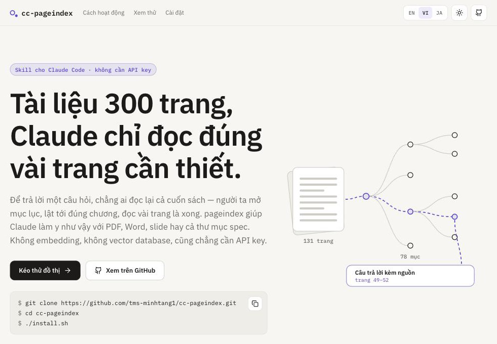

<p align="center">
  
</p>

<h1 align="center">cc-pageindex</h1>

<p align="center"><a href="README.md">English</a> · <b>Tiếng Việt</b> · <a href="README.ja.md">日本語</a></p>

<p align="center">
  <b>Tài liệu 300 trang, Claude chỉ đọc đúng vài trang cần thiết.</b><br>
  Skill cho Claude Code · không cần API key
</p>

<p align="center">
  <a href="https://pagindex.vercel.app/vi"><b>Trang giới thiệu</b></a> ·
  <a href="https://pagindex.vercel.app/demo/shokunin.html">Kéo thử đồ thị</a> ·
  <a href="#cài-mất-chừng-một-phút">Cài đặt</a>
</p>

<p align="center">
  
  
  
  
  
</p>

<p align="center">
  <a href="https://pagindex.vercel.app/vi"></a>
</p>

Để trả lời một câu hỏi, chẳng ai đọc lại cả cuốn sách. Người ta mở mục lục, lật tới đúng chương, đọc vài trang là xong — và nhớ luôn mình lấy thông tin ở đâu.

Claude thì không có thói quen đó. Dán cả bộ spec 300 trang vào thì tốn token, tràn context, mà càng dài nó càng đọc lướt. Không dán thì nó vẫn trả lời, rất trôi chảy, và sai. **cc-pageindex** dạy Claude đọc như người thật: nhìn mục lục, mở đúng mục, đọc xong mới trả lời, kèm số trang để bạn kiểm lại.

Dùng được cho báo cáo, hợp đồng, spec màn hình tiếng Nhật, sách nội bộ — thứ gì đủ dài để bạn ngại đọc lại từ đầu.

```
Bạn:    Trong spec 会員管理, 退会処理 cập nhật cột email thế nào?

Claude: Ghi email thành "<địa chỉ cũ>_<thời điểm hiện tại>", đồng thời đặt
        status = 退会, encrypted_password = chuỗi ngẫu nhiên 20 ký tự đã hash,
        phone_number = NULL, quit_at = thời điểm hiện tại.
        Nguồn: 2.1.会員詳細画面_機能詳細.adoc, dòng 110.
```

## Hỏi về tài liệu dài, cách quen thuộc nào cũng hụt

| | Cách làm | Vấn đề |
| --- | --- | --- |
| ✗ | **Dán hết vào khung chat** | Tốn token, tràn context, tài liệu càng dài model càng đọc lướt và bỏ sót. |
| ✗ | **Cắt nhỏ rồi tìm bằng vector** | Mỗi đoạn bị tách khỏi chương của nó, bảng biểu đứt làm đôi. Đoạn “nghe na ná” câu hỏi chưa chắc đã là đoạn có câu trả lời. Chưa kể phải nuôi thêm embedding model, vector database, và index lại mỗi lần tài liệu đổi. |
| ✓ | **Lần theo mục lục** | Tài liệu tử tế nào cũng có sẵn mục lục. Giữ nguyên nó, việc tìm câu trả lời chỉ còn là chọn đúng mục — và đã biết mình đọc ở đâu thì trích nguồn là chuyện đương nhiên. |

Cái khác không nằm ở chỗ model thông minh hơn, mà ở chỗ nó đang đọc đúng trang.

## Việc tay chân để máy lo, việc suy nghĩ để Claude

Công cụ chỉ làm phần cơ học và không bao giờ gọi model. Từng chữ trong câu trả lời đều do chính session Claude Code của bạn viết — nên không cần API key nào.

1. **Index một lần là xong** · *công cụ*
   Dựng mục lục từ bố cục của PDF, style Heading của Word, cấp tiêu đề AsciiDoc hay tiêu đề từng slide, rồi lưu ngay trên máy bạn. Gặp bản scan hay file text trơn thì Claude đọc qua một lượt và tự đặt tiêu đề.
2. **Tìm mục ngay trên máy** · *công cụ*
   Câu hỏi được đem so với tên và tóm tắt của từng mục, từ nào càng hiếm càng được tính nặng. Tiếng Nhật, tiếng Trung được tách thành từng cụm hai chữ. Hỏi lại đúng câu cũ, kết quả vẫn y như cũ.
3. **Đọc xong mới trả lời** · *Claude*
   Chỉ mở vài mục đứng đầu, xem chúng có thật sự trả lời được không, rồi đáp kèm số trang, số slide, hoặc tên file và số dòng.

Chi tiết cơ chế nằm ở [Cách nó làm việc](docs/how-it-works.md).

## Một câu hỏi, chỉ cần đọc 4 trang

Lần chạy thật trên cuốn *SHOKUNIN IT – Cách người TOMOSIA làm việc* (131 trang, 78 mục). Công cụ chấm điểm toàn bộ các mục, không gọi model:

```
#0036  CHƯƠNG 3: CẢI TIẾN – KAIZEN VÀ SỨC MẠNH CỦA AI      13.91   tr. 49–50   ← đọc
#0037  KAIZEN – ĐI LÊN TỪ NHỮNG BƯỚC CHÂN NHỎ               8.78   tr. 51–52   ← đọc
#0042  AI LÀ NGƯỜI SỬ DỤNG AI HIỆU QUẢ NHẤT ?                7.93   tr. 61–62
```

Claude mở hai mục đầu — 4 trang trên 131 — rồi trả lời:

> **Shokunin kết hợp Kaizen với AI như thế nào?**
>
> Không phải chọn một trong hai. Người shokunin giữ tinh thần Kaizen — cải tiến từng chút nhưng không ngừng, như nguyên lý mỗi ngày tốt hơn 1%, tức (1.01)^365 — và dùng AI để khuếch đại chính nỗ lực đó. Có điều, cải tiến chỉ bền khi nó trở thành tiêu chuẩn chung của cả đội, giống miếng chèn giữ khẩu pháo khỏi tụt dốc trong lúc cả tiểu đội đang kéo pháo lên.
>
> <sub>Nguồn: trang 49–52</sub>

## Đồ thị này có sẵn trong skill

Bảo Claude *“preview tài liệu”*, hoặc tự chạy `pi.py html`, bạn sẽ có một file HTML duy nhất, mở offline được. Trong đó mục lục hiện thành đồ thị trên một mặt bảng kéo tự do như draw.io.

<p align="center">
  <a href="https://pagindex.vercel.app/demo/shokunin.html"></a>
</p>
<p align="center"><sub><a href="https://pagindex.vercel.app/demo/shokunin.html">Bấm vào ảnh để kéo thử bản thật</a></sub></p>

- **Thấy ngay đường đi** — rê chuột vào một mục, đường từ gốc tới đó chạy sáng lên, kèm toàn bộ mục con.
- **Gập bớt cho gọn** — bấm vòng tròn để gập một nhánh; mục vừa bấm vẫn đứng yên chỗ cũ.
- **Dạng cây hay dạng tròn** — trái sang phải để dễ đọc tên mục, xoè tròn để thấy toàn cảnh.
- **Tìm và rà soát** — mục khớp sáng lên và tự mở nhánh, Enter để nhảy qua từng kết quả, một cú bấm lọc ra mục chưa có tóm tắt.
- **Số liệu ngay trước mắt** — mỗi cấp bao nhiêu mục, nhánh nào đang gập, mỗi mục chiếm bao nhiêu phần tài liệu.
- **Một file, chạy offline** — không server, không CDN, dữ liệu không rời khỏi máy. Có giao diện sáng và tối, dùng được bằng chuột, bàn phím lẫn cảm ứng.

## Tài liệu có sẵn cấu trúc gì, dùng luôn cấu trúc đó

| Định dạng | Mục lục lấy từ đâu | Chi phí index |
| --- | --- | --- |
| PDF có chữ | bố cục và bookmark | không tốn model |
| PDF scan | Claude đọc ảnh từng trang | Claude đọc 1 lượt |
| Word `.docx` | style Heading 1–9 | không tốn model |
| PowerPoint `.pptx` | mỗi slide là một mục | không tốn model |
| Markdown | các tiêu đề `#` | không tốn model |
| File text trơn | Claude tự đặt tiêu đề | Claude đọc 1 lượt |
| Thư mục AsciiDoc | cấp tiêu đề `=`, trích nguồn theo file và dòng | không tốn model |

Vì sao lại chia như vậy: [Định dạng tài liệu](docs/formats.md).

## Cài mất chừng một phút

Chỉ cần có **[uv](https://github.com/astral-sh/uv)** hoặc **Python 3.10 trở lên**. Có uv thì khỏi lo Python, uv tự tải bản nó cần.

```bash
git clone https://github.com/TOMOSIA-VIETNAM/cc-pageindex.git
cd cc-pageindex
./install.sh
```

Dùng Windows thì chạy `.\install.ps1`. Muốn gỡ: `./install.sh --uninstall`.

Script sẽ tự dựng môi trường Python riêng và gắn skill vào `~/.claude/skills/`. Xong là mở session Claude Code ở thư mục nào cũng dùng được.

## Rồi cứ thế hỏi

**Index — mỗi tài liệu một lần:**

```
Dùng skill pageindex, index file ~/Documents/bao-cao-2025.pdf
```

**Hỏi — ở bất kỳ session nào sau đó:**

```
Dùng skill pageindex. Doanh thu quý 3 trong báo cáo 2025 là bao nhiêu?
```

**Xem mục lục dạng đồ thị:**

```
Dùng skill pageindex, preview báo cáo 2025
```

Câu trả lời luôn kèm nguồn: số trang với PDF, số slide với PowerPoint, tên file và số dòng với AsciiDoc. Lần theo đó là kiểm lại được.

## Tìm hiểu thêm

| | |
| --- | --- |
| [Định dạng tài liệu](docs/formats.md) | Loại nào index miễn phí, loại nào tốn token, và vì sao |
| [Cách nó làm việc](docs/how-it-works.md) | Công cụ làm gì, Claude làm gì, một câu hỏi được trả lời ra sao |
| [Kho tài liệu](docs/store.md) | Nằm ở đâu, chứa gì, cách xem và xoá |
| [Trang giới thiệu](webapp/README.md) | Mã nguồn của pagindex.vercel.app và cách deploy |

## Giới hạn

Hình ảnh bên trong tài liệu chưa được đọc, trừ khi cả tài liệu là PDF scan. Câu hỏi về bố cục màn hình hay nội dung chỉ nằm trong ảnh sẽ được trả lời thiếu.
