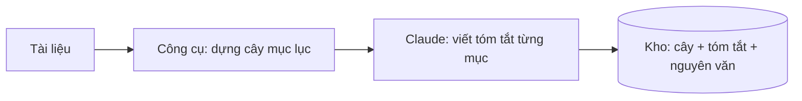
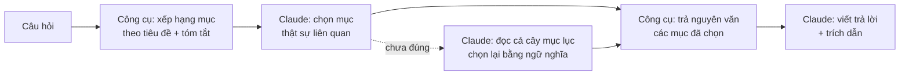

# Cách nó làm việc

Công cụ và Claude chia đôi công việc: công cụ lo phần cơ học, Claude lo phần đọc hiểu và viết. Công cụ **không gọi model nào**, nên mọi bước của nó đều miễn phí.

## Lúc index — một lần cho mỗi tài liệu

Công cụ đọc cấu trúc sẵn có trong file — style Heading của Word, cấp `=` của AsciiDoc, bố cục trang của PDF — dựng thành cây mục lục. Vài giây, không tốn token. Tài liệu không có cấu trúc thì Claude phải đọc trước để tự xác định bố cục.

Rồi Claude đọc nội dung từng mục và viết một đoạn tóm tắt: mục này **chứa** cái gì — tên bảng, con số, tên riêng, quy tắc. Chạy song song nhiều subagent nên nhanh. Đây là phần tốn token chính, chỉ tốn một lần.

Cây, tóm tắt và nguyên văn lưu xuống đĩa.

## Lúc hỏi — mỗi câu hỏi

**Công cụ lọc trước.** So từ trong câu hỏi với tiêu đề và tóm tắt của từng mục, xếp hạng, trả về khoảng 12 mục khớp nhất. Chạy ngay trên máy, không gọi model, không tốn token. Đây là chỗ tiết kiệm lớn nhất — bước "tìm chỗ nào đáng đọc" vốn là bước đắt nhất của các cách làm khác.

**Claude chọn tiếp.** Đọc 12 tóm tắt đó, quyết mục nào thật sự trả lời được câu hỏi. Đây mới là bước dùng ngữ nghĩa.

**Công cụ trả nguyên văn** đúng những mục được chọn — không phải cả tài liệu, thường chỉ vài nghìn ký tự.

**Claude viết trả lời** dựa trên nguyên văn đó, kèm trích dẫn. Tóm tắt chỉ dùng để định tuyến, không được trích dẫn thay nội dung gốc.

**Nếu lọc trượt:** bước xếp hạng chỉ đếm từ trùng, không hiểu nghĩa — nó không biết "văn hoá" với "triết lý" gần nhau. Khi các mục lấy về không trả lời được, Claude bỏ qua bộ lọc, đọc toàn bộ cây mục lục và chọn lại bằng ngữ nghĩa. Chậm hơn, tốn context hơn, nhưng không bị giới hạn bởi từ khoá. Câu bắt liệt kê cả tài liệu ("sách nhắc tới những nhân vật nào") luôn đi đường này.

Tóm lại: **lọc bằng từ → chọn bằng nghĩa → đọc nguyên văn → trả lời.** Hỏi bằng đúng từ tài liệu dùng thì bước lọc chính xác hơn.
