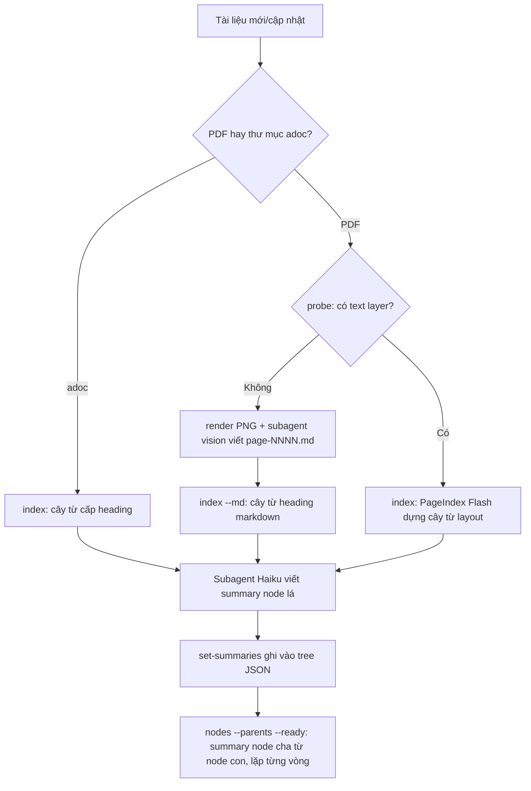

# Proposal: Skill Insight dùng PageIndex (Vectorless RAG) + Claude Session

2026-09-22 · @Minh Tang

## Mục tiêu & bối cảnh

Xây một skill "insight" chạy trong Claude Code/Cowork, dùng cơ chế tree-index + reasoning-based retrieval của PageIndex để trả lời câu hỏi trên tài liệu dài (báo cáo, hợp đồng, spec kỹ thuật — kể cả tài liệu tiếng Nhật cho các dự án với client Nhật), thay cho vector RAG truyền thống.

Tài liệu đích đầu tiên là bộ spec màn hình admin của LivePocket: 230 file AsciiDoc tiếng Nhật, 172 ảnh PNG, 37 thư mục chức năng, tổng 1.3 MB text.

Ràng buộc cốt lõi: không cấu hình thêm API key LLM ngoài (OpenAI/Anthropic key riêng) cho các bước sinh text. Toàn bộ phần "suy luận + sinh chữ" (OCR, tóm tắt node, trả lời câu hỏi) tận dụng chính session Claude đang chạy skill; phần "cơ học" (parse layout, dựng cây phân cấp, lưu trữ, tree-search) giao cho PageIndex.

Trạng thái: bản spike đã chạy được đầu-cuối trên tài liệu thật, code nằm ở `skills/pageindex/`. Phần dưới ghi lại kiến trúc đã chốt sau khi đo trên thư viện bản `pageindex` 0.2.19, cùng những điểm còn phải xác nhận.

## Kiến trúc tổng quan

Chia trách nhiệm rõ 2 lớp:

- **PageIndex (cơ học, dùng nguyên bản, không sửa code)**: parse cấu trúc PDF để dựng tree index (title, page range, node id), lưu tree + text đã cắt dưới dạng JSON trên đĩa, và cung cấp bộ tool đọc tài liệu khi truy vấn.
- **Claude session (toàn bộ phần sinh text)**: đọc trang scan qua vision để "OCR" khi cần, viết summary cho từng node, và khi có câu hỏi thì tự đi cây + viết câu trả lời kèm trích dẫn trang — thay cho việc gọi LLM/API key riêng của PageIndex.

Cầu nối là một CLI mỏng (`skills/pageindex/tools/pi.py`) ghép các entry point công khai của thư viện lại: hàm dựng cây Flash, lớp lưu trữ local, và bộ tool đọc tài liệu. CLI không gọi model nào, nên chạy được khi máy không có API key LLM.

Hai loại nguồn:

- **PDF**: cây lấy từ layout (PageIndex Flash), đơn vị đọc là trang.
- **Cây thư mục AsciiDoc**: cây lấy thẳng từ cấp heading `=`, một node cho mỗi file rồi heading của file nằm dưới. Không dùng Flash vì heading đã là cấu trúc tường minh. Đơn vị đọc là block dòng cố định (mặc định 60 dòng), mỗi block mở đầu bằng marker `// <file> line <N>` để trích dẫn về đúng file và dòng gốc.

## Luồng Index/Update tài liệu

Khi thêm hoặc cập nhật một tài liệu:

0. Nguồn AsciiDoc: `pi.py index <thư mục>` — một thư mục chức năng thành một document, xong trong vài giây, bỏ qua bước 1–3 dưới đây.
1. Nguồn PDF: `pi.py probe` kiểm tra input — có text layer thật hay là bản scan/ảnh, và có ký tự CJK hay không.
2. Nhánh scan/ảnh: `pi.py render` xuất PNG từng trang, session Claude đọc ảnh và viết `page-NNNN.md` sạch (thay cho OCR trả phí của PageIndex Cloud); heading markdown chính là cấu trúc cây.
3. Nhánh có text layer: `pi.py index` chạy Flash local ở chế độ chỉ lấy cấu trúc — thuần heuristic layout, không tốn LLM.
4. Fan-out subagent theo từng node lá (model Haiku) để đọc nội dung và viết summary; `pi.py set-summaries` ghi summary vào tree JSON. Node cha viết summary từ summary của con, không đọc lại nội dung: `pi.py nodes --parents --ready` chỉ trả về node cha đã đủ summary của con, lặp từng vòng cho tới khi hết.
5. Tree JSON + text từng trang nằm trong store trên đĩa, là index chính thức của tài liệu đó.

## Luồng truy vấn/trả lời

Index và hỏi đáp là hai việc tách rời. Index chạy một lần cho mỗi tài liệu và phục vụ mọi câu hỏi về sau, nên không được để câu hỏi nào lọt vào bước đọc trang hay viết summary — summary viết để trả lời một câu hỏi cụ thể sẽ bỏ sót phần còn lại, và câu hỏi tiếp theo phải trả giá.

Store dùng chung, đặt ở thư mục dữ liệu per-user của từng nền tảng (`$XDG_DATA_HOME/pageindex` hoặc `~/.local/share/pageindex` trên macOS và Linux, `%LOCALAPPDATA%\pageindex` trên Windows): đường dẫn tuyệt đối, mọi session và mọi loại tài liệu chung một chỗ. Không đặt trong thư mục được đồng bộ (Documents của iCloud/OneDrive) vì text tài liệu sẽ bị đẩy lên cloud và cơ chế ghi atomic của store hỏng khi sync. CLI từ chối store nằm trong thư mục tạm của hệ điều hành.

Khi có câu hỏi trên tài liệu đã index:

1. `pi.py list` xác nhận tài liệu đã có trong store. Chưa có thì index trước như một việc độc lập.
2. `pi.py retrieve "<câu hỏi>"` xếp hạng mọi node đã index theo độ trùng thuật ngữ — trọng số theo độ hiếm của từ, title tính đôi, tự loại từ xuất hiện ở quá 25% node, tiếng Nhật/Trung cắt bigram. **Bước này không gọi model nào**: cùng store + cùng câu hỏi ra cùng thứ hạng.
3. `pi.py read <doc> --nodes <id,id>` đọc đúng những node đó, không đoán số trang.
4. Session viết câu trả lời kèm trích dẫn: số trang với PDF, tên file + heading (đọc từ marker trong block) với AsciiDoc. Summary chỉ dùng để định tuyến, không được trích dẫn thay nội dung gốc.

Câu hỏi diễn đạt khác chữ trong tài liệu, hoặc câu bắt liệt kê toàn tài liệu, sẽ xếp hạng kém — khi đó đọc `pi.py structure` và đi cây bằng ngữ nghĩa thay vì bằng từ khoá.

Không có bước gọi "chat model" riêng của PageIndex ở đây — toàn bộ phần trả lời do session Claude đảm nhiệm, nên không phát sinh API key/chi phí LLM ngoài.

## Vì sao không cần fork thư viện

Toàn bộ tuỳ biến nằm ở lớp skill bên ngoài, không đụng vào source PageIndex:

| Nhu cầu | Điểm mở rộng dùng |
| --- | --- |
| Bỏ qua OCR trả phí của Cloud | Tự sinh text từng trang, đưa vào store qua `DocStore.save_document` |
| Bỏ gọi LLM lúc index | `page_index_flash(pdf, summary=False, optimize=False)` — thư viện ghi rõ tổ hợp này chạy hoàn toàn không LLM |
| Nguồn AsciiDoc | Parse heading ở lớp skill, ghi vào store qua `DocStore.save_document` — không đụng tới Flash |
| Gán model rẻ cho summary | Subagent riêng (Haiku) sinh text, CLI ghi field `summary` vào tree JSON |
| Đọc tài liệu khi truy vấn | `pageindex.agent_tools.call_tool` — đúng bộ tool `browse_documents` / `get_document` / `get_document_structure` / `get_page_content` mà bản MCP phục vụ |

Vì không sửa code, `pip install -U pageindex` vẫn nâng cấp bình thường, không cần giữ fork riêng.

## Phân bổ model theo từng bước

| Bước | Model | Lý do |
| --- | --- | --- |
| Dựng cấu trúc (PageIndex Flash) | Không cần LLM (heuristic) | Đọc layout PDF có sẵn |
| OCR tài liệu scan | Subagent vision (model nhỏ nếu đủ chất lượng) | Thay OCR trả phí của Cloud |
| Viết summary từng node | Subagent Haiku | Bước này chỉ cần tóm nội dung có sẵn; chạy song song theo node |
| Chọn node + trả lời câu hỏi | Model chính của session | Cần khả năng suy luận tốt nhất, quyết định độ chính xác câu trả lời |

## Kết quả spike đã đo

Chạy trên `pageindex` 0.2.19, máy local, không có API key LLM nào:

- **Flash không LLM chạy được và nhanh.** `page_index_flash(pdf, summary=False, optimize=False)` dựng cây 347 node cho PDF 119 trang trong 4.5 giây, 78 node cho PDF 131 trang trong 5.8 giây. Tiếng Việt có dấu giữ nguyên, không lỗi mã.
- **Không cần ngưỡng heuristic để phát hiện "cấu trúc không đủ rõ".** Thư viện tự trả về `toc_source`; giá trị `pages` (mỗi trang một node) hoặc `unreadable` chính là tín hiệu chuyển sang nhánh Claude tự chia section. CLI phơi ra cờ `flat` theo đúng tín hiệu này.
- **Tên tham số tắt summary khác với dự đoán ban đầu.** `if_add_node_summary` là key config của chế độ standard, không phải cần gạt của Flash. Đường đi không LLM là gọi thẳng `page_index_flash` rồi tự ghi vào store, vì `submit_document` ở chế độ local luôn bật summary và optimize.
- **`as_claude_mcp()` có tồn tại nhưng không dùng được cho skill này.** Ở chế độ local, hàm trả về một MCP server in-process của Claude Agent SDK — chỉ chạy được bên trong một tiến trình Python có `claude-agent-sdk`, không đăng ký được cho session Claude Code. Nhánh HTTP MCP là nhánh cloud, cần API key PageIndex. Skill vì vậy gọi thẳng `agent_tools.call_tool` qua CLI: cùng bộ tool, cùng format kết quả, không cần thêm tiến trình hay đăng ký MCP.
- **Nhánh OCR chạy thông đầu-cuối.** Với PDF 5 trang gần như không có text layer: render PNG → session đọc ảnh, viết `page-NNNN.md` → `index --md` dựng cây từ heading markdown → `structure`/`page` trả về đúng cấu trúc và nội dung, số trang khớp bản gốc.

### Đo trên bộ spec admin của LivePocket

Nguồn: 230 file `.adoc` tiếng Nhật trong 37 thư mục chức năng, 1.3 MB text, 172 ảnh PNG.

- **Index toàn bộ: 6.7 giây, 0 token LLM.** 38 document (37 thư mục + 2 file memo ở thư mục gốc), 230 file, 866 đơn vị đọc, 2152 node. Cây khớp cấp heading của spec, không sai lệch.
- **Fan-out summary trên 会員管理** (7 file, 68 node, 33 node lá, 19.431 ký tự): 3 subagent Haiku chạy song song, tổng 117.493 token subagent, khoảng 30 giây. Chất lượng summary tiếng Nhật đủ để định tuyến — nêu đúng tên bảng, tên cột, điều kiện tìm kiếm, số item trên màn hình, số bản ghi mỗi trang.
- **Summary node cha: 35 node, 4 vòng bottom-up, không đọc lại nội dung gốc.** Mỗi vòng `nodes --parents --ready` trả về đúng tầng đã đủ điều kiện.
- **Kiểm chứng câu trả lời.** Câu hỏi "退会処理 khi thực hiện thì email bị đổi thế nào?": đi từ cây theo summary xuống đúng node, đọc 1 block 60 dòng, ra đúng `URL /users/:id/withdrawn`, `PATCH`, và bảng cập nhật đầy đủ (`status`=退会, `email`=「メールアドレス」+「_」+現在時刻, `encrypted_password`=hash 20 ký tự ngẫu nhiên, `phone_number`=NULL, `quit_at`=現在時刻). Trích dẫn về đúng `2.1.会員詳細画面_機能詳細.adoc line 110`.
- **Cây sau khi có summary: 22 KB JSON cho một thư mục chức năng** — đủ nhỏ để đọc trọn trước khi chọn node.

Ước lượng chi phí summary cho toàn bộ admin: 1212 node lá, 636.174 ký tự text lá. Nhân theo tỉ lệ đo được ở 会員管理 (19.431 ký tự ứng với 117.493 token) ra khoảng **3.9 triệu token subagent** cho một lượt index đầy đủ. Đây là chi phí một lần cho mỗi tài liệu, chỉ chạy lại trên phần thay đổi.

## Điểm còn phải xác nhận

- **172 ảnh PNG chưa được đọc.** Macro `image::` hiện chỉ nằm trong text dưới dạng đường dẫn. Phần lớn thông tin màn hình nằm ở bảng 画面項目 nên text vẫn trả lời được, nhưng câu hỏi về bố cục màn hình thì phải tự mở PNG. Cần đo xem có bao nhiêu câu hỏi thực tế cần tới ảnh trước khi bỏ usage ra mô tả cả 172 ảnh.
- **Chưa đo độ chính xác trên diện rộng.** Mới kiểm 1 câu hỏi có đáp án biết trước. Cần bộ 10–20 câu trải qua nhiều thư mục chức năng, gồm cả câu bắt buộc đọc nhiều document (ví dụ quyền hạn nằm ở `共通_権限` nhưng câu hỏi hỏi về màn hình khác).
- **Câu hỏi bắc cầu nhiều document chưa có cơ chế.** Hiện mỗi thư mục là một document độc lập; `pi.py list` trả về tên + description để chọn, nhưng chưa test khi câu trả lời nằm rải ở 3–4 thư mục.
- **Chi phí summary 3.9 triệu token cho admin là ước lượng ngoại suy**, chưa chạy thật toàn bộ. Số thực có thể lệch vì node lá ở thư mục khác dài ngắn khác nhau.
- Nhánh PDF scan: chất lượng OCR bằng vision trên trang dày chữ tiếng Nhật chưa kiểm chứng; mới chạy trên trang wireframe tiếng Việt ít chữ.

## Bước tiếp theo

1. Soạn bộ 10–20 câu hỏi có đáp án biết trước, trải nhiều thư mục chức năng, gồm câu bắc cầu nhiều document.
2. Chạy summary cho 3–4 thư mục chức năng nữa, đo usage thực tế để thay ước lượng ngoại suy.
3. Chấm độ chính xác và chất lượng trích dẫn trên bộ câu hỏi đó; ghi lại câu nào sai vì thiếu mô tả ảnh.
4. Quyết định có bỏ usage mô tả 172 ảnh hay không, dựa trên số câu hỏi sai ở bước 3.
5. So sánh usage/chi phí với cách làm RAG vector hiện tại trước khi quyết định build chính thức.
