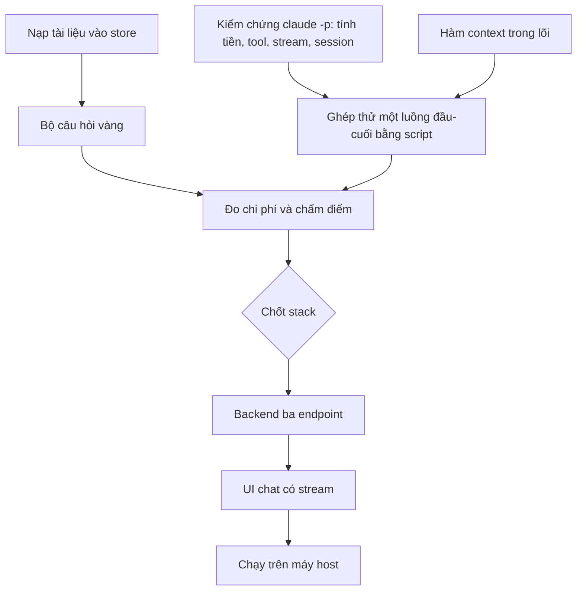

# Kế hoạch: Webapp hỏi đáp tài liệu nội bộ

2026-09-22 · @Minh Tang · đi kèm `SPEC.md` cùng thư mục

Stack chưa chốt, nên kế hoạch chia làm hai phần: phần chạy được ngay (lõi retrieval, Python, không phụ thuộc stack) và phần bị chặn cho tới khi chốt stack. Phần chạy ngay đủ để trả lời câu hỏi lớn nhất còn treo — cách tính tiền và chất lượng trả lời — trước khi bỏ công viết webapp.

## Thứ tự phụ thuộc

Ba việc đầu không phụ thuộc nhau, làm song song được.

---

## Phần không phụ thuộc stack

### Kiểm chứng `claude -p`

Việc rủi ro nhất và rẻ nhất để làm trước. Nếu hoá ra subscription không dùng được theo cách này thì toàn bộ lý do kinh tế của dự án sụp, và thà biết sớm.

Làm: viết một script shell chạy `claude -p` với ngữ cảnh giả, đo từng điều kiện trong `SPEC.md`.

Xong khi:
- Chạy với `ANTHROPIC_API_KEY` đã gỡ khỏi môi trường, đối chiếu usage của tài khoản trước và sau, xác nhận request tính vào subscription chứ không vào API key. Không suy đoán từ tài liệu — phải thấy số thay đổi.
- `--output-format stream-json --verbose` trả ra dòng chữ đầu tiên; ghi lại độ trễ tới ký tự đầu, chạy 10 lần lấy khoảng.
- Tắt hết tool và xác nhận model không gọi được tool nào; thử một prompt cố tình dụ nó đọc file.
- `--session-id` rồi `--resume`: lượt hai hiểu đại từ trỏ về lượt một mà không gửi lại lịch sử.
- Hai tiến trình cùng `--resume` một session id chạy song song: ghi lại chuyện gì xảy ra. Đây là căn cứ để chọn khoá hay xếp hàng.
- Đo transcript dài lên bao nhiêu sau 10 lượt, để đặt ngưỡng cắt hội thoại.

Ra: một trang ghi số đo thật, không phải trích dẫn tài liệu.

### Hàm `context` trong lõi

Làm trong `skills/pageindex/tools/pi.py`, đúng chữ ký trong `SPEC.md`. Bên trong gọi lại `retrieve` và `read` đã có, thêm chính sách cắt theo ngân sách token.

Xong khi:
- `pi.py context "<câu hỏi>"` trả JSON gồm các đoạn đã chọn kèm trích dẫn và tổng token ước tính.
- Cùng câu hỏi trên cùng store ra kết quả giống hệt, chạy lại nhiều lần vẫn thế.
- Vượt ngân sách thì cắt theo thứ hạng từ dưới lên, và nói rõ đã cắt gì.
- Store có tài liệu chưa summary thì cảnh báo, không im lặng trả rỗng.
- Gọi được cả từ Python (`import`) lẫn dòng lệnh, cùng một lõi.
- `retrieve` và `read` giữ nguyên, không bị gộp.

Kiểm: chạy trên store thật, đối chiếu với kết quả `retrieve` + `read` làm tay.

### Nạp tài liệu vào store

Việc vận hành, không phải việc code. Index từng tài liệu như một việc độc lập, tuyệt đối không kèm câu hỏi nào vào prompt viết summary.

Xong khi:
- Sách nội bộ và bộ spec màn hình admin đều có trong store, mọi node đều có summary (`pi.py tree <doc>` báo đủ).
- Ghi lại token và thời gian thực tế cho từng tài liệu.
- Trang xem `pi.py html` mở ra đọc được, dùng để soát chất lượng summary bằng mắt.

### Bộ câu hỏi vàng

Phụ thuộc: store đã có tài liệu.

10–20 câu có đáp án biết trước, do người biết tài liệu soạn, trải nhiều tài liệu và nhiều dạng:

- Câu chi tiết: tên riêng, con số, tên bảng, tên cột.
- Câu liệt kê toàn tài liệu.
- Câu bắc cầu nhiều tài liệu.
- Câu tài liệu không đề cập, để bắt lỗi bịa.
- Câu diễn đạt khác hẳn chữ trong tài liệu, để đo giới hạn của xếp hạng theo từ khoá.

Mỗi câu ghi sẵn đáp án đúng và vị trí đúng trong tài liệu.

Xong khi: bộ câu hỏi nằm trong một file, mỗi câu có đáp án và vị trí, dùng lại được cho mọi lần đo sau.

### Ghép thử một luồng đầu-cuối bằng script

Phụ thuộc: hai việc đầu.

Một script: câu hỏi vào → `context()` → dựng prompt → `claude -p` → chữ chảy ra màn hình. Chưa có web, chưa có UI.

Xong khi:
- Trả lời đúng cho câu hỏi đã biết đáp án, có trích dẫn trỏ đúng chỗ.
- Nói "tài liệu không đề cập" cho câu không có đáp án.
- In ra số token đã gửi mỗi lượt.

Đây là bản chạy được đầu tiên, và là thứ đem đi thuyết phục.

### Đo chi phí và chấm điểm

Phụ thuộc: bộ câu hỏi vàng và script đầu-cuối.

Chạy cả bộ câu hỏi qua script, chấm hai tiêu chí tách rời: nội dung đúng không, và trích dẫn trỏ đúng chỗ không. Ghi token mỗi câu.

Xong khi:
- Có bảng kết quả từng câu: đúng/sai nội dung, đúng/sai trích dẫn, token.
- Có con số so sánh với cách nhồi cả tài liệu vào prompt.
- Có danh sách câu trả lời sai kèm lý do: xếp hạng trượt, thiếu mô tả ảnh, hay tài liệu thật sự không có.

**Điểm dừng để quyết định.** Kết quả ở đây quyết định có làm webapp hay không, và có phải sửa lõi trước không. Không viết dòng web nào trước mốc này.

---

## Phần bị chặn tới khi chốt stack

Ba hướng stack và đánh đổi đã ghi trong `SPEC.md`. Điểm quyết định: lõi là Python, nên stack Python gọi thẳng hàm, stack khác phải đi qua tiến trình con.

Các việc dưới đây chỉ mô tả kết quả cần đạt, không mô tả cách làm, vì cách làm phụ thuộc lựa chọn đó.

### Backend ba endpoint

Cần: `POST /chat` trả stream, `GET /documents` cho bộ lọc, `GET /health`.

Xong khi:
- `POST /chat` phát sự kiện nguồn trước, rồi các mảnh chữ, rồi kết thúc.
- Bộ lọc tài liệu áp được, bỏ trống thì tra toàn store.
- Một hội thoại chỉ chạy một request tại một thời điểm; request thứ hai xếp hàng hoặc bị từ chối rõ ràng, không chạy song song.
- Câu hỏi và câu trả lời được ghi lại độc lập với transcript của Claude, đủ để hiển thị lại lịch sử khi transcript mất.
- `GET /health` báo được store đọc được và `claude` gọi được.

### UI chat có stream

Xong khi:
- Chữ chảy ra dần, không đợi trọn câu trả lời.
- Nguồn hiện ngay khi có, bấm vào xem được nguyên văn đoạn đã dùng.
- Có trạng thái chờ cho quãng 1–3 giây trước ký tự đầu tiên.
- Bộ lọc tài liệu dùng được và bỏ qua được.
- Đọc được trên màn hình hẹp.

### Chạy trên máy host

Xong khi:
- Chạy như một dịch vụ, khởi động lại máy vẫn lên.
- Máy host đăng nhập subscription, môi trường của dịch vụ không có `ANTHROPIC_API_KEY`.
- Chỉ nghe trong mạng nội bộ.
- Store gắn ở chế độ chỉ đọc với tiến trình web.
- Có một trang ngắn nói cách thêm tài liệu mới vào store — việc làm tay, ngoài webapp.

---

## Rủi ro đã biết

| Rủi ro | Biết bằng cách nào | Nếu trúng |
| --- | --- | --- |
| Subscription không dùng được cho cách gọi này, hoặc vi phạm điều khoản | Việc kiểm chứng `claude -p`, và đọc lại điều khoản | Chuyển sang API key, tính lại chi phí, lý do kinh tế của dự án phải xét lại |
| Xếp hạng theo từ khoá trượt quá nhiều | Bộ câu hỏi vàng | Thêm một vòng cho model chọn node từ cây, tức là quay về nhánh agentic đã loại |
| Thiếu mô tả ảnh làm sai câu hỏi về màn hình | Phân loại câu sai khi chấm điểm | Bỏ công đọc ảnh cho những tài liệu cần, đo lại |
| Rate limit chung của tài khoản khi nhiều người hỏi cùng lúc | Thử nhiều request song song | Xếp hàng ở backend, hoặc chuyển sang API key |
| Không có đăng nhập, ai vào URL cũng đọc được spec khách hàng | Đã biết, là quyết định có ý thức | Thêm đăng nhập trước khi mở rộng người dùng |
