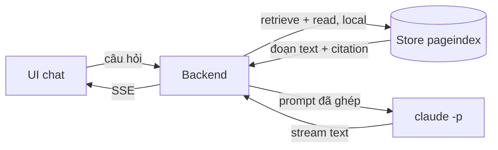

# Spec: Webapp hỏi đáp tài liệu nội bộ trên lớp retrieval pageindex

2026-09-22 · @Minh Tang

Tài liệu này mô tả cái sẽ build, không phải cái đã build. Lõi retrieval (`skills/pageindex/`) đã chạy được; phần webapp chưa viết dòng nào.

## Mục tiêu

Một webapp chat nội bộ để hỏi tài liệu đã index: spec màn hình tiếng Nhật, sách nội bộ, hợp đồng, tài liệu kỹ thuật dài. Thay cho việc mở file đọc tay hoặc dán cả tài liệu vào chat.

Ràng buộc chi phí là lý do tồn tại của thiết kế này: bước tìm "đọc gì" chạy hoàn toàn local, không token, không API call. Chỉ bước viết câu trả lời mới cần model, và model đó chạy qua `claude -p` trên subscription của máy host, không qua API key trả tiền theo lượt.

Người dùng: thành viên trong team, truy cập trong mạng nội bộ.

## Kiến trúc: pre-retrieval

Backend tự tra cứu trước, rồi đưa kết quả cho model viết câu trả lời. Model không có tool, không tự quyết định đọc gì.



Đánh đổi đã chốt: bỏ nhánh agentic (để Claude tự chạy công cụ tra cứu nhiều vòng). Đổi lại được chi phí biết trước, một lượt sinh, độ trễ thấp, và luồng stream sạch — nhánh agentic phát ra cả sự kiện gọi tool mà UI phải lọc.

Hệ quả phải chấp nhận: câu hỏi mà một vòng tra cứu không đủ sẽ trả lời thiếu. Backend không tự tra vòng hai.

## Ranh giới

**Luôn làm**

- Tra cứu ở backend trước khi gọi model. Model không bao giờ tự chọn tài liệu.
- Trả kèm trích dẫn: số trang với PDF, tên file và dòng với AsciiDoc.
- Nói rõ khi tài liệu không trả lời được câu hỏi, thay vì suy từ kiến thức chung.
- Mở store ở chế độ chỉ đọc.

**Hỏi trước khi làm**

- Mở webapp ra ngoài mạng nội bộ.
- Thêm tài liệu mới vào store từ phía webapp.
- Đổi từ subscription sang API key để tính tiền.

**Không làm**

- Không index từ webapp. Index là việc offline, chạy bằng tay, và không được nhận bất cứ thông tin nào về câu hỏi đang hỏi.
- Không cho model đọc file nguồn (PDF, `.adoc`) trực tiếp — chỉ đọc qua store.
- Không ghi vào store từ tiến trình web.
- Không trích dẫn summary thay cho nội dung gốc. Summary do model nhỏ viết, dùng để định tuyến, không phải bằng chứng.

## Chức năng

### Hỏi đáp

Người dùng gõ câu hỏi, nhận câu trả lời stream về kèm danh sách nguồn đã đọc. Mỗi nguồn hiện tên tài liệu, tiêu đề mục, khoảng trang hoặc dòng, và bấm vào xem được nguyên văn đoạn đã dùng.

### Phạm vi tài liệu

Mặc định tra toàn bộ store. Có bộ lọc chọn một hoặc nhiều tài liệu để thu hẹp. Bộ lọc là tuỳ chọn, không phải bước bắt buộc trước khi hỏi.

### Hội thoại nhiều lượt

Giữ ngữ cảnh bằng transcript của Claude: mỗi hội thoại một `--session-id` cố định, lượt sau dùng `--resume`. Backend không gửi lại lịch sử.

Ba hệ quả phải xử lý, không được bỏ qua:

- Một session id chỉ chạy một request tại một thời điểm. Cần khoá theo hội thoại; request thứ hai đến khi đang bận thì xếp hàng hoặc từ chối, không chạy song song.
- Transcript là file trên máy host. Mất máy là mất lịch sử. Webapp phải tự lưu tối thiểu câu hỏi và câu trả lời để hiển thị lại, độc lập với transcript.
- Transcript dài lên theo từng lượt, nên chi phí mỗi lượt tăng dần. Cần một ngưỡng độ dài để bắt đầu hội thoại mới.

### Không có đăng nhập

Chạy trong mạng nội bộ, không xác thực. Hệ quả: không biết ai hỏi gì, và bất kỳ ai vào được URL đều đọc được toàn bộ nội dung tài liệu trong store — bao gồm spec của khách hàng. Quyết định này phải được xem lại trước khi đưa lên bất cứ địa chỉ nào ngoài mạng nội bộ.

## Giao diện backend

Không phụ thuộc stack. Ba endpoint:

| Endpoint | Việc |
| --- | --- |
| `POST /chat` | Nhận `{question, conversation_id, docs?}`, trả stream: sự kiện `sources` trước, rồi các mảnh `text`, cuối cùng `done` |
| `GET /documents` | Danh sách tài liệu trong store cho bộ lọc: tên, mô tả, số đơn vị đọc, số node đã có summary |
| `GET /health` | Store đọc được, `claude` gọi được, có bao nhiêu tài liệu |

Sự kiện `sources` gửi trước phần text để UI hiện nguồn ngay trong lúc câu trả lời còn đang chảy.

## Phụ thuộc vào lõi pageindex

Webapp cần một thứ lõi chưa có: một lời gọi trả về ngữ cảnh đã chọn sẵn, thay cho việc gọi `retrieve` rồi `read` rồi tự ghép.

```
context(question, docs=None, top=8, budget=8000)
  → {sections: [{doc, node_id, title, pages, cite, text}], tokens, query}
```

Bên trong chính là `retrieve` + `read` đã có, thêm một chính sách cố định: lấy top-N, cắt theo ngân sách token, trả kèm trích dẫn. Chạy local, không token, không API call.

Giữ `retrieve` và `read` riêng, không gộp. Trong phiên chat của agent, model cần nhìn bảng xếp hạng để tự quyết hỏi lại hay mở rộng — `context()` là phần ghép sẵn cho bên không có ai phán giữa chừng.

Phơi ra ba đường từ cùng một lõi: hàm Python, lệnh `pi.py context`, và nếu cần thì HTTP.

## Cách gọi model

```
claude -p --output-format stream-json --verbose \
  --session-id <uuid hội thoại> \
  --disallowed-tools <tất cả> \
  "<ngữ cảnh đã tra cứu + câu hỏi>"
```

Lượt sau thay `--session-id` bằng `--resume <uuid>`.

Bốn điều kiện vận hành:

- Máy host phải đăng nhập subscription Claude, và **không được có `ANTHROPIC_API_KEY` trong môi trường** — có key là tính tiền theo API. Phải kiểm bằng cách chạy thật rồi đối chiếu usage, không đoán.
- Tắt hết tool. Kiến trúc này không cần tool nào, và tool bật lên là mở đường cho model tự đọc file ngoài store.
- Mỗi request spawn một tiến trình, độ trễ cỡ 1–3 giây trước khi chữ đầu tiên chảy ra. UI phải hiện trạng thái chờ.
- Rate limit tính theo tài khoản, không theo người dùng. Nhiều người hỏi cùng lúc sẽ đụng trần chung.

Dùng subscription để phục vụ người dùng cuối của một ứng dụng là câu hỏi về điều khoản sử dụng, không phải câu hỏi kỹ thuật. Phạm vi nội bộ cho team thì bình thường; mở rộng ra ngoài thì phải rà lại điều khoản và nhiều khả năng phải chuyển sang API key.

## Kiểm thử

| Lớp | Kiểm cái gì |
| --- | --- |
| `context()` | Cùng câu hỏi + cùng store ra cùng kết quả. Ngân sách token được tôn trọng. Tài liệu không có summary thì cảnh báo chứ không im lặng trả rỗng. |
| Bộ câu hỏi vàng | 10–20 câu có đáp án biết trước, trải nhiều tài liệu, chấm hai tiêu chí: nội dung đúng, và trích dẫn trỏ đúng chỗ. Trích dẫn sai nghiêm trọng ngang nội dung sai. |
| Câu không có đáp án | Câu hỏi về thứ tài liệu không đề cập. Kỳ vọng: nói không có. Trượt nếu bịa. |
| Hội thoại | Lượt hai hiểu được đại từ trỏ về lượt một. Hai request cùng lúc trên một hội thoại không giẫm nhau. |
| Chi phí | Đo token mỗi câu hỏi, so với cách nhồi cả tài liệu, và so với RAG vector hiện tại. |

Bộ câu hỏi vàng là điều kiện để phát hành, không phải việc làm sau.

## Quyết định còn mở

**Stack chưa chốt.** Ba hướng đã cân:

| Hướng | Được | Mất |
| --- | --- | --- |
| Python + HTML/JS thuần | Backend cùng ngôn ngữ với lõi, gọi thẳng hàm `context()`, không qua tiến trình trung gian. Ít thành phần nhất. | UI chat phải tự viết từ đầu |
| Python + React | Như trên, thêm UI chat đầy đủ | Thêm bước build, thêm phần phải bảo trì |
| Node/TypeScript | Hợp nếu team quen TS hơn | Phải gọi `pi.py` qua tiến trình con, mất kiểu dữ liệu, thêm một lớp có thể hỏng |

Điểm quyết định: lõi retrieval là Python. Stack Python gọi thẳng hàm; stack khác phải đi qua tiến trình con và parse JSON từ stdout.

Chốt stack là điều kiện để bắt đầu phần webapp. Phần `context()` trong lõi không chờ quyết định này.

## Không nằm trong phạm vi

- Index tài liệu từ webapp.
- Nhiều người dùng, phân quyền, nhật ký theo người.
- Đưa ra ngoài mạng nội bộ.
- Mô tả ảnh trong tài liệu — ảnh hiện chưa được đọc, câu hỏi về bố cục màn hình sẽ trả lời thiếu.
